  

    <twemoji-pine-decoration />SQL Server輪講<twemoji-pine-decoration />
  

  

    第8回 ~ネットワーク~
  

  

    2025/1/10 江袋 叡
  

---

# 今回やること

- SQL Serverとクライアントの通信方法
  - プロトコル
  - 通信時のデータ構造
  - インスタンスへの接続方法(ポート/キャッシュ)

---
clicks: 1
---

# SQL Serverとクライアントが通信を行うには

- SQL Serverの通信では独自のフォーマットや抽象化アルゴリズムが用いられている
  - ホストとクライアントの双方にネットワークコンポーネントが必要
- プロトコルは何種類かある
  - この部分の差異はSNI(SQL Server Network Interface)層によって吸収されている

  
  

---

# SNI層

- 複数のクライアント毎に、それぞれ異なるプロトコルで待機できる(サーバー側)
- 通信時は基本的に1つのプロトコルが使われる
  - 複数のプロトコルを有効化して、優先順位を決めておくこともできる(クライアント側)
  - デフォルトのプロトコルで接続できない場合に、別のプロトコルを使って接続を試みる

| プロトコル                     | 説明                                                                                                                                                                                                                                  |
| ------------------------------ | ------------------------------------------------------------------------------------------------------------------------------------------------------------------------------------------------------------------------------------- |
| TCP/IP                         | 相互に接続されているネットワーク上のコンピュータ間の通信を実現 インターネットで広く使われている                                                                                                      |
| 名前付きパイプ                 | 同一コンピュータ/ネットワークで実行されているプロセス間で、共有メモリ領域を使用してやり取り                                                                                                             |
| 共有メモリ                     | SQL Serverとクライアントが同一のコンピュータ上で実行されている場合に使用される 最も単純 設定もあまりできなくて多くの場面で使用されない、トラブルシューティング時など |
| VIA(Virtual Interface Adaptor) | 仮想化専用ハードウェアで動作する SQL Server2016以降では非サポート                                                                                                                                   |

---

# SNI層

- [Named Pipes vs. TCP/IP Sockets](<https://learn.microsoft.com/ja-jp/previous-versions/sql/sql-server-2016/ms187892(v=sql.130)#named-pipes-vs-tcpip-sockets>)
  - 名前付きパイプでホストとクライアントが同一環境にいる場合、カーネルモードで実行され非常に高速<twemoji-thumbs-up />
  - WANやダイアルアップ接続などで低速環境の場合、名前付きパイプは非常にコストが掛かるらしい<twemoji-thumbs-down />
- これらの有効/無効や優先順位はSQL Server構成マネージャで設定できる

[インストール後の構成](https://learn.microsoft.com/ja-jp/sql/database-engine/configure-windows/default-sql-server-network-protocol-configuration?view=sql-server-ver16)

| Edition            | TCP/IP  | 名前付きパイプ               | 共有メモリ |
| ------------------ | ------- | ---------------------------- | ---------- |
| Enterprise         | Enabled | ネットワーク接続に対して無効 | Enabled    |
| Standard           | Enabled | ネットワーク接続に対して無効 | Enabled    |
| SQL Server Express | 無効    | ネットワーク接続に対して無効 | Enabled    |

---

# Postgresでは...

- [フロントエンド/バックエンドプロトコル](https://www.postgresql.jp/document/8.0/html/protocol.html)

| 項目 | 説明 |
| --- | --- |
| クライアント/サーバー | クライアントはpsqlなど、サーバーはPostgres本体 |
| サポートプロトコル | TCP/IP, UNIXソケット |

---

# アプリケーションプロトコル層

- アプリケーションプロトコル層では、TDS(Tabular Data Stream)でデータを扱う
- SNI層では、TDSに各プロトコル毎のヘッダーを付与して送信

  

---
clicks: 2
---

# Tabular Data Stream

- RDBMSにおいて、 0 && 'text-orange'">様々な種類のデータを効率的に扱うためのプロトコル
- 基本的にSQL Serverにおいて使用されている
  - 昔のSybase Adaptive Server Enterpriseでも使用されていたらしいが、それぞれ独自に進化、現在は非互換
  - 仕様書は[ココ](https://learn.microsoft.com/en-us/openspecs/sql_server_protocols/ms-sstds/dab36a48-6c13-44c7-954a-0f5c8623590d)

***

  

  - クライアントから送信されるメッセージの例
    - ログイン情報
    - SQLコマンド
    - バイナリデータを含むSQLコマンド
      - `BULK INSERT`など
    - リモートプロシージャコール(RPC)
      - RPCの名前、実行オプションやパラメータ
    - アテンション
      - 送信済みリクエストのキャンセル
    - トランザクションマネージャリクエスト
      - 分散トランザクションの場合

  

  

  - サーバーから送信されるメッセージの例
    - ログインレスポンス
    - 行データ
      - SQLコマンドの結果セット
    - 戻り値ステータス
      - RPC実行時の結果
    - リターンパラメータ
      - UDF(User Defined Function)、RPC、ストアドプロシージャのリターンパラメータ
    - リクエスト終了
    - エラーメッセージ・情報メッセージ
    - アテンション
      - クライアントからのリクエストのキャンセル

  

---

# Tabular Data Stream

補足

- リモートプロシージャコール
  - パラメータに関する作業や構文解析を省くことでパフォーマンスを向上させる処理
  - ここでは、一般的な別コンピュータのプロシージャを呼び出す処理とは異なるらしい
- 分散トランザクション
  - 複数のリソースに対して行うトランザクション処理

---

# Tabular Data Stream

- TDSのうちのバッファデータにデータ本体が入る
- ヘッダー部分にはプロセスID(SPID)や、メッセージタイプなどのメタデータが含まれている
- セットで**バッファ**と呼ばれ、<u>1つ以上</u>のバッファを使用してデータを送受信する

  

---

# Tabular Data Stream

- バッファデータは更に**トークン**の単位で構成される
  - [ROW(0xD1)](https://learn.microsoft.com/en-us/openspecs/windows_protocols/ms-tds/3840ef93-3b10-4aca-9fd1-a210b8bb6d0c):行データなどの詳細情報
- バッファは単なる固定サイズのハコであり、メッセージの中身がバッファ毎にどのように構成/区切られているかまでは関知しない
  - トークンを利用することで、受け手の情報の復元を容易にする

  

---

# Tabular Data Stream

[Packet Data Token Stream Definition](https://learn.microsoft.com/en-us/openspecs/windows_protocols/ms-tds/67b6113c-d722-42d1-902c-3f6e8de09173)

  

  | トークン            | 識別子  |
  | ------------------ | ------- |
  | ALTMETADATA         | 0x88 |
  | ALTROW              | 0xD3 |
  | COLINFO             | 0xA5 |
  | COLMETADATA         | 0x81 |
  | DATACLASSIFICATION  | 0xA3 |
  | DONE                | 0xFD |
  | DONEINPROC          | 0xFF |
  | DONEPROC            | 0xFE |
  | ENVCHANGE           | 0xE3 |
  | ERROR               | 0xAA |
  | FEATUREEXTACK       | 0xAE |
  | FEDAUTHINFO         | 0xEE |

  

  

  | トークン            | 識別子  |
  | ------------------ | ------- |
  | INFO                | 0xAB |
  | LOGINACK            | 0xAD |
  | NBCROW              | 0xD2 |
  | OFFSET              | 0x78 |
  | ORDER               | 0xA9 |
  | RETURNSTATUS        | 0x79 |
  | RETURNVALUE         | 0xAC |
  | ROW                 | 0xD1 |
  | SESSIONSTATE        | 0xE4 |
  | SSPI                | 0xED |
  | TABNAME             | 0xA4 |
  | TVP_ROW             | 0xF3 |

  

---

# Tabular Data Stream

- ただし、シンプルなデータのやり取りのときはトークンは使われない
  - バッファヘッダーの情報以上にバッファデータの情報が必要ない場合
  - 複数のバッファに分割されても復元が容易

  

---

# Tabular Data Stream

[Packet Data Token and Tokenless Data Streams](https://learn.microsoft.com/en-us/openspecs/windows_protocols/ms-tds/dc3a0854-8230-482f-bbb9-d94a3b905a26)

  

  
トークンあり

  

  |種別|メッセージ|
  |---|---|
  |クライアントから|バイナリデータを含むSQLコマンド|
  |クライアントから|リモートプロシージャコール|
  |サーバーから|ログインレスポンス|
  |サーバーから|行データ|
  |サーバーから|戻り値ステータス|
  |サーバーから|リターンパラメータ|
  |サーバーから|リクエスト終了|
  |サーバーから|エラーメッセージ・情報メッセージ|

  

  

  

  
トークンなし

  

  |種別|メッセージ|
  |---|---|
  |クライアントから|ログイン|
  |クライアントから|SQLコマンド|
  |クライアントから|アテンション|
  |クライアントから|トランザクションマネージャリクエスト|
  |サーバーから|アテンション|

  

  

---

# インスタンスへの接続(ポートの扱い)

- デフォルトインスタンス(現在のシステム?)
  - ポート番号は1433で固定されているのでそこに行けばつながる

<v-clicks depth="1">

- 名前付きインスタンス
  - ポート番号は動的に割り当てられる
    - インスタンス起動時に未使用のポートを自身に割り当てる
    - 通常は一度割り当てられたポートを再利用しようとする
- ...が、通常は名前付きインスタンスを探しに行くのがなかなか大変
  - [SQL Server Browserサービス](https://learn.microsoft.com/ja-jp/sql/tools/configuration-manager/sql-server-browser-service?view=sql-server-ver16)に問い合わせることで、名前付きインスタンスのポート番号を取得できるのでそれを活用する

</v-clicks>

---

# インスタンスへの接続(接続情報のキャッシュ)

- それでも毎回SQL Server Browserサービスに問い合わせるのはコストが掛かる
- `HKEY_LOCAL_MACHINE\SOFTWARE\Microsoft\MSSQLServer\Client\SNI11.0\LastConnect`のようなレジストリキーに接続情報がキャッシュされる
  - 接続に使用したプロトコル名
  - インスタンス名
  - ポート番号

---

# まとめ

- SQL Serverでは通信のプロトコルは複数あり、優先度を定めることができる
- 様々な種類のデータを効率的に扱うためにTDSが使われている
- 名前付きインスタンスに接続するにはややコストが掛かる
  - SQL Server Browserサービスとキャッシュが活用される
