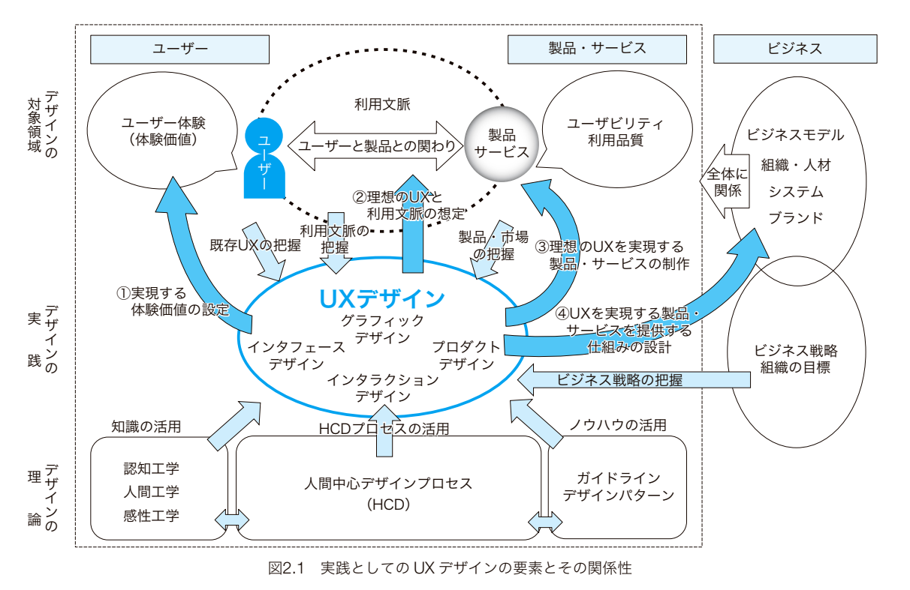

# 概要
## 背景
- 製品やサービスを企画段階からユーザー体験を目標にしてデザインすることをUXデザインと呼ぶ
    - ここでのデザインは広義
    - ユーザーが商品を知るまでの過程、取扱説明書、アフターケア
- 2000年代前半から、特にスマートフォンの台頭により、着目されてきた
    - ユーザビリティを超える、ことが意識されるようになった
        - ユーザー利用の実態は、実験室で考えられる用途よりも遥かに多岐にわたる
        - 更に長期的に使われることもある
        - 要するに想定できない使い方が多い
- ユーザーがほしいのは、過程ではなく結果
- 製品が価値を持つのではなく、ユーザーが価値を作り出す
    - 口コミやレビューはユーザーが使用体験をイメージする手がかり

## 人間中心デザイン(Human Centered Design)
- 技術中心のデザインではヒューマンエラーは起こらない想定(責任は人間側にある)
- ユーザーが理解していることをデザイナーが理解する**二次理解**が基本となる
    - ただし、ユーザーがユーザー自身を完全に理解できているわけではない
    - こちら側が、ユーザーのことをユーザーよりも詳しくなる必要がある
- すべての商品はセルフサービス商品
    - ユーザーが使用するときに助けてくれる人はいない

## 歴史的な流れ
- コンピューターは内部の処理を隠蔽し、ユーザーの感覚的な処理に対して出力を行っている
    - カプセル化と似ている
- ソフトウェアによるインターフェースを**認知的インターフェース**と呼ぶ

## UXデザインが目指すもの
- 会社がUXデザインを行うケースは次の3つのパターンがある(新しい価値・既存への付加価値)
    - 新しい体験価値を実現する新サービスの開発
    - 既存ビジネスに新しい価値を与える新サービス
    - 従来型のサービスのユーザー体験の質の向上

- 例:お土産
    - お土産を誰かに贈る行為は例えば以下のような体験価値を含む
        - 贈り物を選ぶ体験
        - 贈り物を贈る体験
        - 贈り物を消費する体験
    - 1つめの体験をするユーザーはあとの2つを想起しながら行う
    - そうすると商品の見た目は重要
        - ユーザー利用用途を想定し、イメージを重ねられるパッケージなど

# 基礎知識
## UXデザインの要素と関係性

- UXデザインは次の区分に分けられる
    - デザインの対象領域
        - 市場調査などの現状把握
    - デザインの実践
    - デザインの理論

- サービスの性能や品質がユーザーの行動を制約していることもある
- ユーザーが嬉しいだけではなく、企業価値をちゃんと示せる提案

### アプローチ

1. ユーザーの体験価値を決める
    - 最初に製品やサービスのコンセプトを決めてしまうと、それによって実現するUXはその機能を使うことが目的になってしまう
2. 利用文脈を想定する
    - 1.を感じるような行為や状況を逆算する
3. プロトタイプの作成とユーザー視点での評価
4. s－ビスを提供する仕組みの設計

## ユーザーとは

- 直接ユーザーと間接ユーザー
    - 直接ユーザー
        - システムと相互作用する人
        - 1次ユーザー
            - 目標の達成のためにシステムと相互作用する人
        - 2次ユーザー
            - システムへのサポートを提供する人
    - 間接ユーザー
        - システムの出力を受け取る人
- 障害を持った人や文化、環境など多様性は多岐にわたる
- 製品を使う前、製品を知るプロセスもUXの一部
    - ユーザーではなく、消費者の段階
- デザイナーの意図とは裏腹に、ユーザーは製品の結果しか受け取ることができない

### 体験期間

- 予期的UX
    - 購入前
- 瞬間的UX
    - 利用中
    - 直感的で感情的な反応に基づく
- エピソード的UX
    - 利用後
    - ユーザーの行動とその結果に対する心理的な判断に基づく
- 累積的UX
    - サービスに触れていない期間も含む
    - 「愛着」といった形で出てくる
    - ブランドイメージ(予期的UXのにもつながる)

### ユーザーが感じること

- 自己効力感
    - 分からなくてもやれるように頑張れると思うか
- 個人的な目的や価値観と対象となる製品との関係
- 理解と意欲(経験)のサイクルによって、期待が作られていく
- ニーズ(手段)と体験価値(目的)は異なる

## 利用文脈

- 文脈とは自然な制約

- 人間-機械インターフェース
    - 身体的側面
    - 頭脳的側面
    - 時間的側面
    - 環境的側面
    - 運用的側面

- 行為のインターフェース
    - 

# プロセス

- ウォーターフォール開発に置いて、UXデザインを行うのは本来要件定義前
    - 設計で行うのはUIデザイン

# 手法

- KA法
- 仮説(自身のバイアス)を捨てて、ユーザーの声をすべて拾う
    - 感じる価値は複数存在する
    - インタビュー中ではユーザーの感じ方に重要度を加味しない(分析時に行う)
    - 前提は与えない(ユーザー側のバイアス)

# 参考
- [「のどが渇いた」というユーザーに何を出す？ ユーザーの「欲しい」に惑わされない、本当のインサイトを見つけるUXデザイン・UXリサーチ](https://www.slideshare.net/storywriterjp/uxux-252954680)
- [45分間で「ユーザー中心のものづくり」ができるまで詰め込む](https://www.slideshare.net/storywriterjp/45-252537767)
- [なぜエンジニアが作る画面はダサいのか…?](https://qiita.com/mskmiki/items/544149987475719e417b)