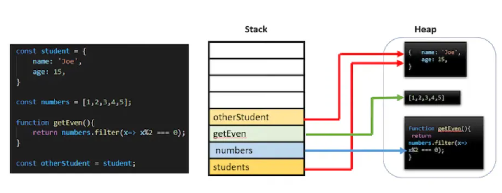
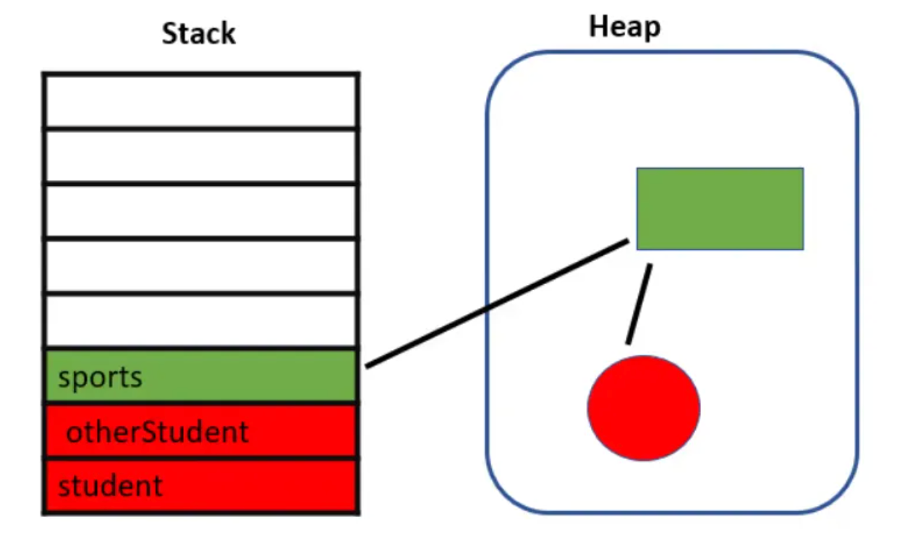
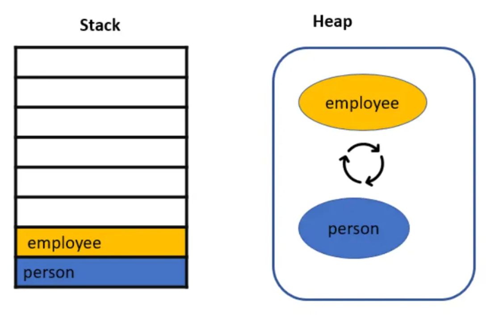
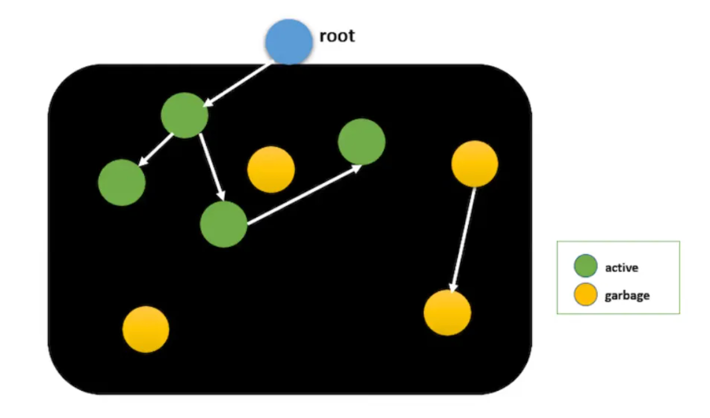

# メモリ管理

- メモリ領域にはStackとHeapがある

## Stack/Heap

- プリミティブ型はStackに格納される


- オブジェクト、配列、関数などの参照型はHeapに格納される
- オブジェクトの参照(変数)はStackに格納され、実際のオブジェクトはHeapに格納される


## 不要な参照/到達不能コード

- GCは不要な参照や到達不能コードを見つけて、それをクリアする
  - 参照カウントとマークアンドスイープアルゴリズムを用いる

### 参照カウント

- Heap上のオブジェクトを指すStack上の参照がない場合、オブジェクトを解放できる
- 以下の場合、`student`と`otherStudent`はnull参照としているため、Heap上のこれらの参照は解放できる
- しかし、`sports`によりその参照先のオブジェクトは解放できない

```javascript
let student = {
    name: 'Joe',
    age: 15,
    sports: ['soccer', 'chess']
}
let otherStudent = student;
const sports = student.sports;
student = null;
otherStudent = null;
```



- この方法だけだと循環参照の問題を解決できない
- 以下の場合、Stack上の参照は切れているが、Heap上で循環参照を起こす

```javascript
let person = {
    name: 'Joe'
};
let employee = {
    id: 123
};
person.employee = employee;
employee.person = person;
person = null;
employee = null;
```



### マークアンドスイープアルゴリズム

- ルートから走査を開始し、ルートから参照差sれている全てのオブジェクトを検索する
- 到達可能オブジェクトにはactiveを付与する
- activeとしてマークされていないメモリをGCで回収する


# メモリリークの種類

## 宣言されていない、または偶発的なグローバル変数

- 参照無しで変数を作成すると、そのルートはグローバルオブジェクトになる
- ルートを直セスサス参照は常にactiveであるため、GCはそれらを開放できない

```javascript
function foo(){
    this.message = 'I am accidental variable';
}
foo();
```

## クロージャ

- クロージャは外部関数のスコープにアクセスできる関数
- 以下の例だと`largeArray`は使用されていない(返されていない)が、外部スコープとして参照することで使用されていなくてもメモリ内に存在し続けることとなる

```javascript
function outer(){
    const largeArray = []; // unused array
    return function inner(num){
        largeArray.push(num);
    }
}
const appendNumbers = outer(); // get the inner function
// call the inner function repeatedly
for (let i=0; i< 100000000; i++){
    appendNumbers(i);
}
```

## タイマー

- 例えば外部スコープ関数をタイマーで呼び出すと、タイマーが停止するまでactiveのままとなり解放されない
- 以下の例だとずっと解放されることはない

```javascript
function generateRandomNumbers(){
    const numbers = []; // huge increasing array
    return function(){
        numbers.push(Math.random());
    }
}
setInterval((generateRandomNumbers(), 2000));
```

- 解決法としては、なにかのタイミングで明示的にクリアする

```javascript
const timer = setInterval(generateRandomNumbers(), 2000); // save the timer
    // on any event like button click or mouse over etc
    clearInterval(timer); // stop the timer
```

## DOM参照

- DOMから削除されたがメモリ内でまだ使用可能なノードがあるとGCが解放できない
- 以下ではクリックすると子要素が削除されるが、イベントリスナーは常にactiveであるのでメモリを保持し続ける
- 解決法としては、`removeEventListner()`でイベントリスナーが不要になったら登録を解除する

```javascript
let parent = document.getElementById("#parent");
let child = document.getElementById("#child");
parent.addEventListener("click", function(){
    child.remove(); // removed from the DOM but not from the object memory
});
```
