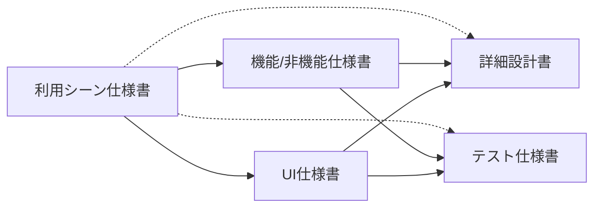

  

    ソフトウェア開発現場の 「失敗集」 集めてみた
  

  

    第4回
  

  

    2025/4/1 江袋 叡
  

---

# 今回のお話

「仕様」で失敗シリーズ

- 実装できない「ふんわり仕様」
  - 仕様そのものがあいまいなお話
- 解読が必要な「難読仕様書」
  - 仕様書の書き方があいまいなお話

---
layout: image
image: images/7.jpg
---

  

    実装できない「ふんわり仕様」
  

---

## データファイルの保護をしたい...

  

    
  - セキュリティのサーベイがあって、データファイルを暗号化する仕様が追加になった
  - 暗号化だけならライブラリ呼び出すだけだし余裕そう
  - 2日あればできるかな
  - とりあえず要件はこんな感じで...
    - > 要件：データはパスワードで保護すること

  

  

    
  

---

## ...で、どう実装する?

> 要件：データはパスワードで保護すること

  

    
  - 強度要件
    - 長さ
    - 文字種
  - 入力時
    - 入力値のマスク
    - コピペの禁止
    - 現在のパスワードの強度レベルの表示
    - 一時的に表示するボタン
  - 関連機能
    - パスワードリセット機能
  - 他にもありそう...

  

  
  

  

  気軽に引き受けたはいいが、実装者の一存で決められないものが多い...

  評価工数も予定より増大<twemoji-chart-increasing />

  

  

  

---

## なぜこのようなことが起きてしまうのか

- 設計者の経験が浅く、十分な想定ができない
- 本当に必要な要件が、一担当者では判断できない
- 面倒なのでとりあえず書いたはいいが、詳細を考えずにそのまま
- 要件の粒度が大きすぎる

開発初期ほどふんわりして、工数見積も難しい...

なるべくふわふわ仕様<twemoji-cloud />を避けるにはどうすればよいか <twemoji-thinking-face />

---
clicks: 1
---

## ユーザーの利用シーンを具体的に想像してみる<twemoji-light-bulb />

ステークホルダーを集めて、ワークショップ形式で実践すると良いらしい。

> 「今日の仕事終わりにアームチェックの状況を確認しよう。」
> 
> そういって俺はアプリのデータ確認ボタンをクリックして、4桁のパスワードを入力した。
>
> 「えーっと、パスワードは1,2,3,4っと...あ、声に出しちゃった」
>
> 正直なところ、操作室への出入りは限られているので別にパスワードはなくてもいいと思うのだが、データにアクセスする権限を規制することで、ポカミスやカジュアルなデータ改ざんを防ぐ狙いがあるらしい。

今回の例だと、具体的な要件と、簡単な確認ができれば良い機能である、ということがわかった。

利用シーンを明確にすることで、非機能要件まで見えてくる。

---

## 教訓

<table class="text-xl">
<tr>
<td>
  
失敗<twemoji-weary-face />

</td>
<td>

- 詳細があいまいな「ふんわり仕様書」で日程遅れを出した

</td>
</tr>
<tr class="!border-0">
<td>
  
回避策<twemoji-thumbs-up />

</td>
<td>

- 最初に利用シーン仕様書を作成し、システムのあるべき振る舞いを想定する

</td>
</tr>
</table>

---
layout: image
image: images/8.jpg
---

  

    解読が必要な「難読仕様書」
  

---

## イイカンジのレイアウト

  

    
  - ダイアログ内のUIパーツをバランスよく配置してほしい
  - 画面を拡大/縮小してもバランスを損なわないように
  - もちろん操作性を損なわないように
  - こんな感じの仕様で...
    - > 仕様：ダイアログは「サイズ変更グリップ」でウィンドウサイズを変更できる。その際各要素のバランスを崩さないようにすること。

  

  

    
  

---

## 作ってみたはいいものの...

> 仕様：ダイアログは「サイズ変更グリップ」でウィンドウサイズを変更できる。その際各要素のバランスを崩さないようにすること。

どちらも仕様通りに実装していると言える。
どうなれば正解?

  

---

## なぜこのようなことが起きてしまうのか

- 仕様書の解釈が人によって分かれるような書き方をしてしまった
- 結論や伝えたいことが明確でない(ロジカルシンキングができていない)
  - 外注する場合は共通認識も薄くなりがちなので更に注意が必要

なるべくあいまいな記述を避けるにはどうすればよいか <twemoji-thinking-face />

---

## いろんな手段で曖昧さを減らす<twemoji-memo />

ロジカルな文章を組み立てることができるのであればそれに越したことはないが、なかなか難しい。

- 仕様書に図や絵を添えてみる

- 仕様を再考してみる
  - そもそもこの機能はユーザーにとって必要なのか?
  - ダイアログの大きさは変更できなくても良いのでは?

---

## 教訓

<table class="text-xl">
<tr>
<td>
  
失敗<twemoji-weary-face />

</td>
<td>

- あいまいな文章でで仕様書を記載し、設計ミスが発生

</td>
</tr>
<tr class="!border-0">
<td>
  
回避策<twemoji-thumbs-up />

</td>
<td>

- よりシンプルで伝わりやすい仕様に
- 簡単な絵などを添えて、意図をより明確に

</td>
</tr>
</table>

---

# まとめ

- 仕様を考えるときは、利用シーンの認識を明確に
- 仕様はなるべくシンプルに、複雑になりがちな場合は図や絵を添えて意図を明確に

