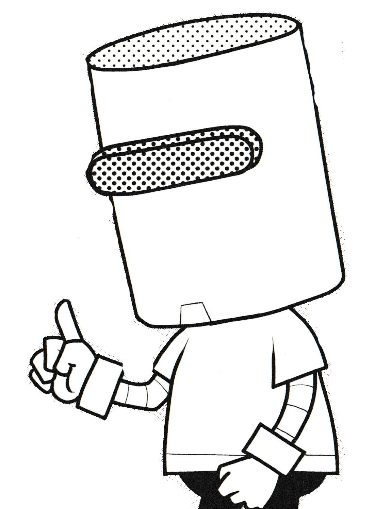

  

    ソフトウェア開発現場の 「失敗集」 集めてみた
  

  

    2025/7/29 江袋 叡
  

---

# 今回のお話

「進捗管理」で失敗シリーズ

- メールが業務の起点「メールドリブンワークスタイル」
  - タスクの依頼をすべてメールでやってしまう
- 変更されない「完璧な計画書」
  - 何があっても当初の計画を守る

---
layout: image
image: images/mail.jpg
---

  

    
メールが業務の起点

    
「メールドリブンワークスタイル」

  

---

## 業務の起点はメール/Teamsになりがち

  

  <v-clicks>

  - 「資料の作成をお願いします」
  - 「この仕様の確認をお願いします」
  - 「評価項目の確認をお願いします」
  - 「打ち合わせに参加してください」

  </v-clicks>
  

  

    
  

---

## メールなどの連絡は大量に来る

  

  <v-clicks depth="1">

  - そもそも全部ちゃんと目を通していると時間が足りない
    - Github<logos-github-icon />のメール設定: 「All Activity」+数日休んでいると、150件ぐらい溜まっていることも
      - 特にリーダー的な立場になると、もっと色んな人から連絡が来がちな気がする
  - 簡単なメールだと、背景がわからず優先度の判断が難しい
    - ただでさえ大量のメールが来るのに、ちゃんと判断しようとするとパンクしてしまう
    - かといって文章量が多いのも読むのに腰を据える必要が
  - だんだんメーラーを開くのも億劫に

  </v-clicks>
  

  
  

  

  
  

  

  忙しいと業務依頼をTeamsの連絡などで済ませてしまいがちだが、業務の意義や価値、目的、期待などの説明が十分でないと、思わぬ落とし穴になる。

  プロジェクトの遅延<twemoji-turtle />、顧客対応の遅れ<twemoji-turtle />、事業継続のリスク<twemoji-bomb />...

  

  

  

---

## もちろんテキストベースの連絡はいいところも大いにある

- 自分のタイミングで確認できる
  - 今やっている業務を中断せずに済む
  - 一度中断すると、集中状態に戻るには時間が必要
- エビデンスになる
  - あとから自分で振り返ることができる
  - 言った言わないのトラブルを防ぐ

...が、認識のすれ違いを抑えるにはどうすればよいか <twemoji-thinking-face />

---

## 直接会って要請する<twemoji-speaking-head />

結局直接会って、重要性や期待を話すのが一番早い。

進めるべきタスクがあるときは、お互い相手の事情を共有する必要がある。

リモートワークのときも、Web会議を活用する。

---

## 教訓

<table class="text-xl">
<tr>
<td>
  
失敗<twemoji-weary-face />

</td>
<td>

- 業務要請をメールだけで済ませ、期待する成果が出なかった。

</td>
</tr>
<tr class="!border-0">
<td>
  
回避策<twemoji-thumbs-up />

</td>
<td>

- メールだけで済まさず、直接会って要請する。
- 要請をする際には、業務の重要性や価値、成果への期待を伝える。

</td>
</tr>
</table>

---
layout: image
image: ./images/schedule.jpg
---

  

    
変更されない

    
「完璧な計画書」

  

---

## イイカンジのレイアウト

  

    
  - ダイアログ内のUIパーツをバランスよく配置してほしい
  - 画面を拡大/縮小してもバランスを損なわないように
  - もちろん操作性を損なわないように
  - こんな感じの仕様で...
    - > 仕様：ダイアログは「サイズ変更グリップ」でウィンドウサイズを変更できる。その際各要素のバランスを崩さないようにすること。

  

  

    
  

---

## 作ってみたはいいものの...

> 仕様：ダイアログは「サイズ変更グリップ」でウィンドウサイズを変更できる。その際各要素のバランスを崩さないようにすること。

どちらも仕様通りに実装していると言える。
どうなれば正解?

  

  

---

## なぜこのようなことが起きてしまうのか

- 仕様書の解釈が人によって分かれるような書き方をしてしまった
- 結論や伝えたいことが明確でない(ロジカルシンキングができていない)
  - 外注する場合は共通認識も薄くなりがちなので更に注意が必要

なるべくあいまいな記述を避けるにはどうすればよいか <twemoji-thinking-face />

---

## いろんな手段で曖昧さを減らす<twemoji-memo />

ロジカルな文章を組み立てることができるのであればそれに越したことはないが、なかなか難しい。

- 仕様書に図や絵を添えてみる

- 仕様を再考してみる
  - そもそもこの機能はユーザーにとって必要なのか?
  - ダイアログの大きさは変更できなくても良いのでは?

---

## 教訓

<table class="text-xl">
<tr>
<td>
  
失敗<twemoji-weary-face />

</td>
<td>

- あいまいな文章でで仕様書を記載し、設計ミスが発生

</td>
</tr>
<tr class="!border-0">
<td>
  
回避策<twemoji-thumbs-up />

</td>
<td>

- よりシンプルで伝わりやすい仕様に
- 簡単な絵などを添えて、意図をより明確に

</td>
</tr>
</table>

---

# まとめ

- 仕様を考えるときは、利用シーンの認識を明確に
- 仕様はなるべくシンプルに、複雑になりがちな場合は図や絵を添えて意図を明確に

