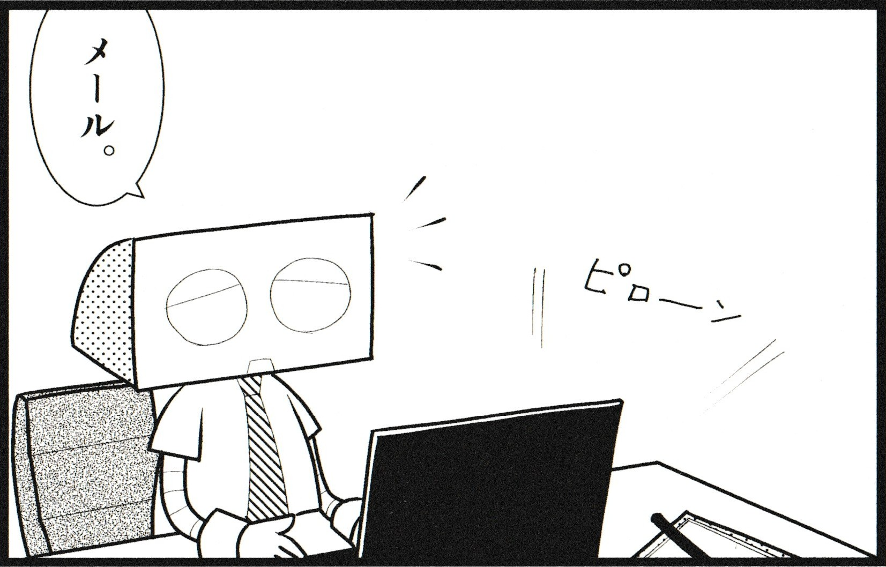

  

    ソフトウェア開発現場の 「失敗集」 集めてみた
  

  

    2025/7/29 江袋 叡
  

---

# 今回のお話

「進捗管理」で失敗シリーズ

- メールが業務の起点「メールドリブンワークスタイル」
  - タスクの依頼をすべてメールでやってしまう
- 変更されない「完璧な計画書」
  - 何があっても当初の計画を守る

---
layout: image
image: images/mail.jpg
---

  

    
メールが業務の起点

    
「メールドリブンワークスタイル」

  

---

## 業務の起点はメール/Teamsになりがち

  

  <v-clicks>

  - 「資料の作成をお願いします」
  - 「仕様書の確認をお願いします」
  - 「評価項目の確認をお願いします」
  - 「打ち合わせに参加してください」
  - ...

  </v-clicks>
  

  

    
  

<!-- 
- 聞いてる側も、仕様書レビューとか、誰の確認を取ればいいかわからなかったりする
-->

---

## メールなどの連絡は大量に来る

  

  <v-clicks depth="1">

  - 全部ちゃんと目を通していると時間が足りない
    - Github<logos-github-icon />のメール設定: 「All Activity」+数日休んでいると、150件ぐらい溜まっていることも
      - 特にリーダー的な立場になると、もっと色んな人から連絡が来がちな気がする
  - 簡単なメールだと、背景がわからず優先度の判断が難しい
    - ただでさえ大量のメールが来るのに、ちゃんと判断しようとするとパンクしてしまう
    - かといって文章量が多いのも読むのに腰を据える必要が
  - だんだんメーラーを開くのも億劫に
  - メール以外にも...<logos-microsoft-teams />

  </v-clicks>
  

  
  

  

  
  

  

  忙しいと業務依頼をTeamsの連絡などで済ませてしまいがちだが、業務の意義や価値、目的、期待などの説明が十分でないと、思わぬ落とし穴になる。

  - プロジェクトの遅延<twemoji-turtle />
  - 顧客対応の遅れ<twemoji-turtle />
  - 事業継続のリスク<twemoji-bomb />...

  

  

---

## もちろんチャットベースの連絡はいいところも大いにある

- 自分のタイミングで確認できる
  - 今やっている業務を中断せずに済む
  - 一度中断すると、集中状態に戻るには時間が必要
    - 最近はチャットベースでも業務が中断されると感じるケース[^1]も多いらしいが...
- エビデンスになる
  - あとから自分で振り返ることができる
  - 言った言わないのトラブルを防ぐ

...認識のすれ違いを抑えるにはどうすればよいか <twemoji-thinking-face />

[^1]: [仕事中の“集中力の途切れ”で日本は25.8兆円の損失、Dropbox調査](https://ascii.jp/elem/000/004/175/4175165/)

---

## 直接会って要請する<twemoji-speaking-head />

結局直接会って、重要性や期待を話すのが一番早い。

進めるべきタスクがあるときは、お互い相手の事情を共有する必要がある。

リモートワークのときも、Web会議を活用する。

---

## 教訓

<table class="text-xl">
<tr>
<td>
  
失敗<twemoji-weary-face />

</td>
<td>

- 業務要請をメールだけで済ませ、期待する成果が出なかった。

</td>
</tr>
<tr class="!border-0">
<td>
  
回避策<twemoji-thumbs-up />

</td>
<td>

- メールだけで済まさず、直接会って要請する。
- 要請をする際には、業務の重要性や価値、成果への期待を伝える。

</td>
</tr>
</table>

---
layout: image
image: ./images/schedule.jpg
---

  

    
変更されない

    
「完璧な計画書」

  

---

## 当初の計画から色々ありどんどん遅延...

  

    
  <v-clicks>

  - 機能実装が思ったよりも時間がかかった
  - 実装したはいいものの、アーキテクチャを守れていなかったので作り直し
  - 実装後に仕様がひっくりかえる
  - 全く別の仕事が舞い込む
  - メンバー離脱
  - ...

  </v-clicks>

  

  

    
  

<!--
- 仕様のレビューが思ったよりも時間がかかる、このため実装完了と逆転する
- プロトタイプまで作ったけど、思ったものじゃない
-->
---

## それでも引き直されない計画

  

  <v-clicks depth="1">

  - 開発計画を立ててスケジュールを守るように進めないことには破綻してしまう
    - 後続工程への影響
  - ただし、時によって極端な残業でなんとかしてしまうことも
    - 間に合ってしまうと、次もそれが前提となった計画となってしまう
    - エスカレートするとメンバーの心身の健康を害してしまう

  </v-clicks>
  

  
  

  

  
  

  

  あまりにも現実的ではない状況に陥ってもリスケされないことが常態化すると、メンバーも相談しなくなる。<twemoji-skull />

  結果的に課題を隠蔽することになる。

  

  

---

## ソフトウェア開発は遅れるもの

大体いつも想定を超えたことが起こる。

計画を立てることは非常に重要ではあるが、計画通りに完璧にはいかないだろうな、ということだけはなんとなくわかる。

- 要望があとから追加された
- メンバーが突然入院
- 市場で重篤な問題が発生
- メンバーが引き抜かれた
- プログラムの基礎になるコンポーネントが販売中止/商用利用停止/致命的なバグ
- プログラムがかけないメンバーがいた
- 発注ミス
- 作るものを間違えた

想定される想定外の事態にはどう対応すればよいか<twemoji-thinking-face />

<!--
- 重なるインシデント
-->
---

## 変化に強いスケジュール&ツール<twemoji-toolbox />

  

    
  - どうせ遅れるので、ある程度バッファを入れておく
  - 日程変更に対応できるスケジュール管理ツール
    - クリティカルパス[^1]と人員を可視化できるもの
      - [Microsoft Project](https://www.microsoft.com/ja-jp/microsoft-365/project/project-management)
      - [Lychee Redmine](https://lychee-redmine.jp/)
    - 今の管理ツールはどうでしょう?
      - Githubの[Projects](https://docs.github.com/ja/issues/planning-and-tracking-with-projects/customizing-views-in-your-project/changing-the-layout-of-a-view)
      - エクセルはしんどい
    - 日程見直しのチェックポイントも設ける

  

  

    
  

[^1]: 「前のタスクが終わらないと次のタスクが始められない」という依存関係で結んだときに、日数が最長になる経路のこと

---
layout: iframe
url: https://www.microsoft.com/ja-jp/microsoft-365/project/project-management
---

---
layout: iframe
url: https://lychee-redmine.jp/
---

---

## 教訓

<table class="text-xl">
<tr>
<td>
  
失敗<twemoji-weary-face />

</td>
<td>

- 計画を変更せず、課題対応の遅れとメンバーへの負担を増やした。

</td>
</tr>
<tr class="!border-0">
<td>
  
回避策<twemoji-thumbs-up />

</td>
<td>

- 計画にリスクを組み込む。(バッファとチェックポイント)
- クリティカルチェーンが管理でき、日程変更に強いツールを使う。

</td>
</tr>
</table>

---

# まとめ

- 重要な業務は直接会って、背景を共有する。
- 計画を立てるときはバッファを十分に、適宜見直す。

